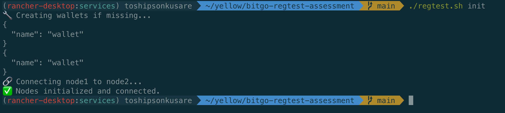
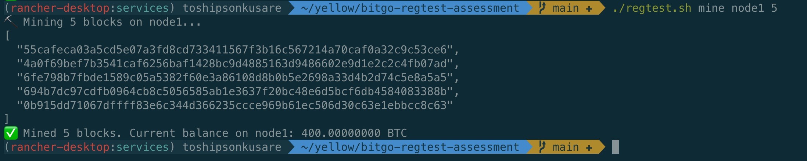
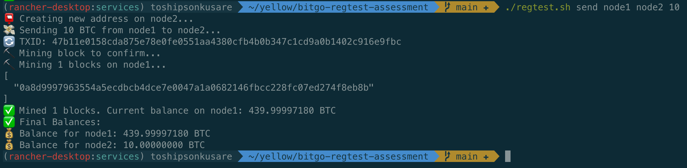
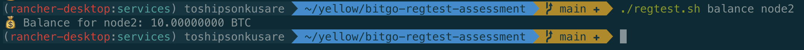
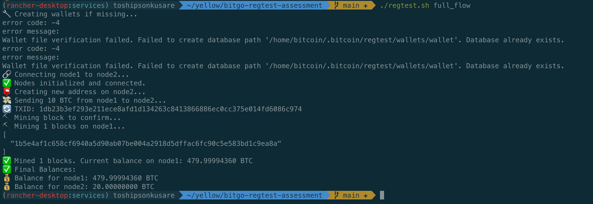
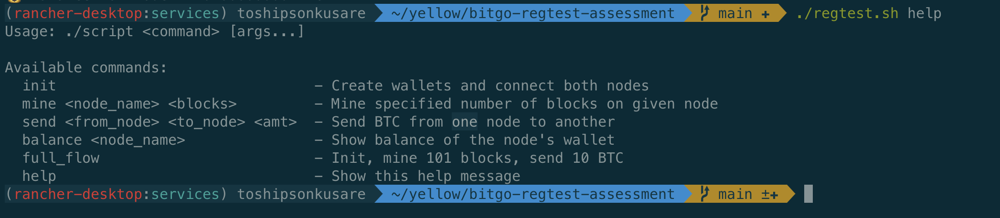

# Bitcoin Regtest Automation

This project sets up a local Bitcoin regtest network using [bitcoin-core](https://github.com/bitcoin/bitcoin) and Docker Compose.
It includes a Bash script (`regtest.sh`) to automate common tasks like:

- Creating and connecting nodes
- Mining blocks
- Sending BTC between nodes
- Checking wallet balances

---

## Prerequisites

- Docker
- Docker Compose
- Unix-like OS (Linux/macOS)
- Bash shell (the script is written in Bash)

---

## Quick Start

Start the nodes and run the full automated flow:

```bash
docker compose up -d
sleep 10 # Waiting for nodes to come up
chmod +x ./regtest.sh
./regtest.sh full_flow
```

This will:
1. Launch 2 bitcoin-core nodes
2. Create wallets and connect the nodes
3. Mine 101 blocks to unlock funds
4. Send 10 BTC from node1 to node2
5. Print final wallet balances

---

## Getting Started

### Start the Bitcoin regtest network

Run the following command to spin up two bitcoin-core nodes in regtest mode:

```bash
docker compose up -d
```

This starts two containers:
- `node1`
- `node2`

Each runs in regtest mode.

---

## Script: `regtest.sh`

The `regtest.sh` script automates interactions with the running Bitcoin nodes.

**Note: Make the script executable `chmod +x regtest.sh`**

### Available Commands

#### 1. Initialize Nodes
```bash
./regtest.sh init
```
Create wallets and connect the two nodes together.


#### 2. Mine BTC
```bash
./regtest.sh mine <node_name> <blocks>
```
Mine a specific number of blocks on a node.  
**Example:**
```bash
./regtest.sh mine node1 5
```


#### 3. Send BTC
```bash
./regtest.sh send <from_node> <to_node> <amount>
```
Send BTC from one node to another.  
**Example:**
```bash
./regtest.sh send node1 node2 10
```


#### 4. Check Balance
```bash
./regtest.sh balance <node_name>
```
Show wallet balance for a node.  
**Example:**
```bash
./regtest.sh balance node2
```


#### 5. Executes full workflow
```bash
./regtest.sh full_flow
```
Runs the complete flow:
- Initialize
- Mine 101 blocks in node1 if mining reward is not enabled
- Send 10 BTC from node1 to node2
- Confirm transaction



#### 6. Help
```bash
./regtest.sh help
```
Display help message.



---

## Environment Configuration (`.env`)

You can configure your Bitcoin RPC credentials using a `.env` file in the project root:

```
RPCUSER=admin
RPCPASSWORD=admin
```

These credentials are automatically loaded and used by both the `docker-compose.yml` and `regtest.sh` script.  
If the `.env` file is missing, the script will exit with an error.

To change the RPC credentials, simply update the values in `.env`.

---

## CI/CD (GitHub Actions)

This project includes GitHub Actions workflows to:

- CI: Lint the regtest.sh script and validate docker-compose.yml
- CD: Start the regtest system, run full_flow, and validate final balances

The workflows trigger on all file changes except for Markdown (.md) files.

---

## 🧹 Clean Up

To stop and remove the running containers:

```bash
docker compose down
```

## Design Trade-offs

This project intentionally simplifies certain aspects for the sake of rapid development. 
Below are key trade-offs made:

### 1. Same RPC credentials for both nodes
**Trade-off:** Both nodes use the same `rpcuser` and `rpcpassword` values.  
**Why:** Simplifies script development and Docker Compose setup. In a production or multi-tenant environment, 
unique credentials per node are recommended for security and access control.

### 2. Static Wallet Name (`wallet`)
**Trade-off:** Wallet name is hardcoded.  
**Why:** Simplifies scripting logic. Doesn't support multiple concurrent wallets out-of-the-box.

### 3. Two-node only architecture
**Trade-off:** Hardcoded to two nodes for simplicity.  
**Why:** Focused on minimal setup for fast experimentation, it doesn't simulate full peer-to-peer network behavior.

### 4. Using `.env` for credentials  
**Trade-off:** Credentials are stored in a `.env` file for simplicity and committed to GitHub.  
**Why:** This simplifies local development, testing and CI/CD workflow. In real-world scenarios, you should never commit credentials.
